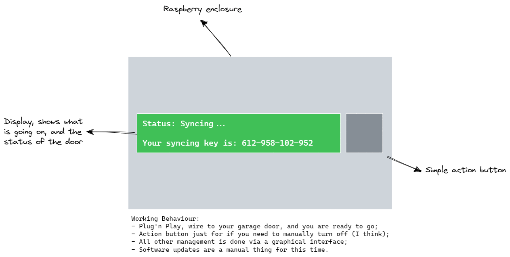
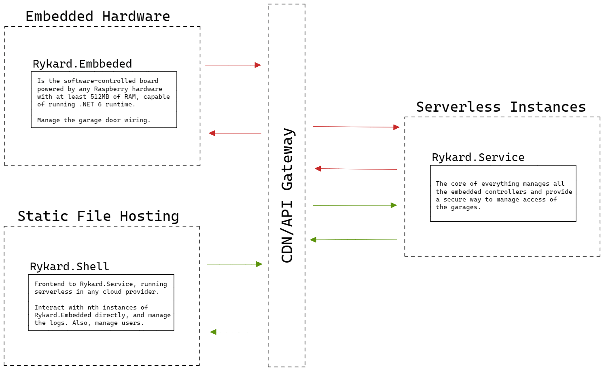

# Rykard Infrastrucure

Um *overview* rápido de como tudo vai funcionar quando parar de ser um MVP, e efetivamente começar a me ajudar a controlar os portões de garagem da minha casa, bem como talvez, os do condomínio onde moro.

# Por que?

Moro bem longe da portaria do meu condomínio, bom na verdade não é bem um condomínio, daí não existe guarita, por tanto todo o controle de entrada e saída de pessoas, carros (e cavalos, moro muito no interior) ou prestadores de serviços, acaba ficando no manual.

Como um bom gordo que não se desloca de casa, e que também é totalmente refém do transporte por aplicativo, não fica legal ir até a portaria somente para acionar um portão, daí tive a ideia de todo engenheiro de software que se preze: Gastar horas (nesse caso, dias) automatizando um processo relativamente funcional, com tecnologia de ponta, e fazer funcionar.

> **Nota**: Atualmente tudo não passa de um delírio da minha cabeça. Como o nome do projeto é Rykard, é entendível que efetivamente o que faço da minha vida é jogar Elden Ring.

# Rykard resolve o meu problema?

Depende, se você também se desloca muito à trabalho, ou viaja com frequência, com certeza é uma alternativa válida, e o mais importante, totalmente *self-hosted*, sem backdoors de provedores de cloud ou hardware pré-fabricado. Da para perceber que caso seu foco ser privacidade e forte controle de acesso, também vai ser uma boa pedida.

Entretanto caso seu objetivo é ter um sistema de portaria digital, integrando fechaduras câmeras (essa, na verdade está nos planos para depois do MVP), com certeza é um não. Acredito que quando estiver funcional na ideia da arquitetura, novas *features* podem aparecer, mas não é uma certeza também.

# `Rykard.Embbeded`

Como o nome do projeto e seu `namespace` raiz já deixa claro, trata-se da peça de software que irá realizar a *bridge* entre o frontend do projeto e os motores de um portão eletrônico, juntamente com o monitoramento de todas as informações de seu *host*, e do *status* de funcionamento do portão onde estes motores estão conectados.

> **Nota**: Via de regra, pelo que conheço de motores de portão, o que é relativamente o mesmo conhecimento que tenho sobre naves espaciais, nunca vi nenhum com mais de um motor, mas vou deixar uma relação de um portão contem vários motores (`p` ⊃ `m` ).  

Idealmente, será o *host* das soluções embarcadas um Raspberry de qualquer modelo, que tenha condições de executar o *runtime* do .NET 6, tendo em vista que será escrito em C# seu código-fonte, juntamente com um display para facilitar adicionar um novo dispositivo dentro da sua conta, algo parecido com isso:

Quando passar da prototipação, vou deixar aqui neste repositório como imprimir a *case*, e também, qual é o display a ser instalado, botão, versão da Rasp e por fim uma build pronta do Raspbian já com o `Rykard.Embbeded` funcionando.

> **Nota**: Na imagem já diz, mas OTA não vai ser algo que vai existir no MVP, outro ponto importante, é que o fluxo de *onboarding* de um novo dispositivo também não é algo claro na minha cabeça no momento. E seguirei utilizando um possível *endpoint* SignalR (AKA websocket) para conversar com o *device*, ou via RESTful caso eu ficar preguiçoso no caminho. Nada de IoT-native por aqui, pois me falta conhecimento para fazer dessa forma, tanto é que ao invés do .NET Embedded, estou usando a versão normal do Framework.

# `Rykard.Shell`

É a forma que você vai gerenciar tudo o que vai acontecer com os seus portões, desde auditar aberturas do portão até comportamentos inespecíficos (como uma tentativa de arrombamento, caso eu decida por colocar sensores de posição do portão e correlacionar com acionamentos). Claro, isso tudo só no visual, quem realmente toma conta de todas essas ações é o `Rykard.Service`.

Ainda não tenho uma ideia clara em mente de como deve ficar a UI/UX da plataforma, mas será feito em Blazor, para acompanhar a ideia do projeto ser integralmente escrito apenas em C#. O lado bom é que pode ser colocado em qualquer servidor estático de arquivos.

# `Rykard.Service`

Quem realmente vai fazer essa brincadeira toda funcionar e se conversar, desde enviar alertas até acionar portões. Uma das *features* que irei implementar é *tokens* de acesso únicos ou baseados em tempo, para facilitar a entrada de prestadores de serviços (por exemplo, poder fazer funcionar um ciclo do portão em uma janela de tempo).

Este cara, por ser o mais complexo de todos, também não tenho uma ideia muito clara, mas é o único que já sei como será feita toda sua engenharia de software, sendo baseado no *pattern* Request-Endpoint-Response em cima de uma *minimal* API do .NET 6. A autenticação do usuário e das instâncias do `Rykard.Embedded` será baseada em JWT, não há necessidade de reinventar a roda, com todas as *features* básicas de tal, *refresh token*, TTL e o resto você (deveria) saber.

A ideia é ser algo *self-hosted*, indo na ideia de ser algo que você pode fazer o *deployment* em um PC velho ai na sua casa, ou compartilhar a Rasp do `Rykard.Embedded` com o backend e frontend. Entretanto para ambientes de mais missão crítica, meio que não tem um jeito fácil de fugir da cloud, então também é possível fazer todos os serviços, com exceção daquilo que é físico, logicamente, *cloud-native*, ainda não defini qual será o provedor de *cloud*.

Uma ideia totalmente simplificada, seria assim (abstraia para o formato de *deploy* que mais te agradar):

# Documentação mais completa

Ainda WIP, ao decorrer dos próximos dias (ou semanas) devo popular mais informações pertinentes ao processo de *roles*, *user groups*, *administrators* e informações mais detalhadas de como deve funcionar a arquitetura de tudo isso. Também devo começar a estudar em como integrar as operações condizentes com as permissões de um usuário com a Amazon Alexa e o Google Home (YAY, mais backdoors num projeto focado em privacidade!).

# Limitações

Não sou um desenvolvedor *fullstack* experiente, trabalho apenas com backend e segurança de aplicações no meu dia-a-dia, por tanto não espere um esteira memorável ou um frontend belo. Também não irei dedicar muitas horas para fazer isso acontecer, está mais para um laboratório de estudos, e se caso funcionar, ai sim dar continuidade na ideia e fornecer o suporte que todo OSS deve ter.

> **Nota**: Caso quiser dar uma ajudada nas contribuições, e não se sentir confortável em fazer isso de modo público aqui no GitHub, ou queira trocar uma ideia, manda um salve no `dunno at zone16 dot wtf`.

# Licença

Ainda não decidi qual o formato do licenciamento, até segunda ordem, considere todo o conteúdo disponibilizado aqui como [WTFPL](http://www.wtfpl.net/).